# zkInfo 系统架构图与数据流图

## 📋 目录

1. [系统整体架构图](#1-系统整体架构图)
2. [启动与数据加载流程](#2-启动与数据加载流程)
3. [服务注册与 MCP 生成流程](#3-服务注册与-mcp-生成流程)
4. [虚拟项目编排流程](#4-虚拟项目编排流程)
5. [参数解析与工具生成流程](#5-参数解析与工具生成流程)
6. [外部调用链路](#6-外部调用链路)
7. [数据流转图](#7-数据流转图)
8. [核心功能时序图](#8-核心功能时序图)
9. [数据表关系图](#9-数据表关系图)
10. [组件交互图](#10-组件交互图)
11. [关键配置与端点](#11-关键配置与端点)
12. [状态转换图](#12-状态转换图)
13. [性能优化点](#13-性能优化点)
14. [功能模块详细架构图](#14-功能模块详细架构图)
15. [功能模块数据流图](#15-功能模块数据流图)
16. [模块间交互图](#16-模块间交互图)
17. [核心节点详细架构图](#17-核心节点详细架构图)
18. [核心节点时序图](#18-核心节点时序图)

---

## 1. 系统整体架构图

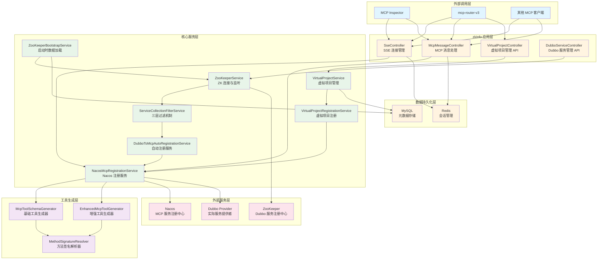

---

## 2. 启动与数据加载流程

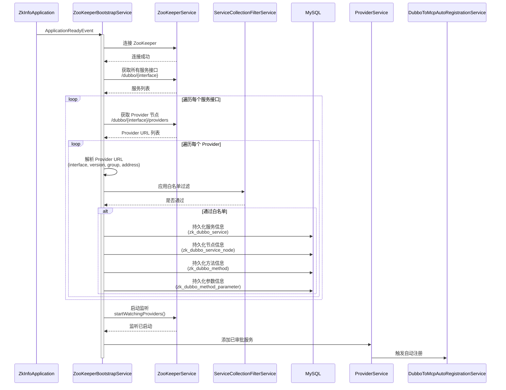

### 2.1 白名单过滤流程

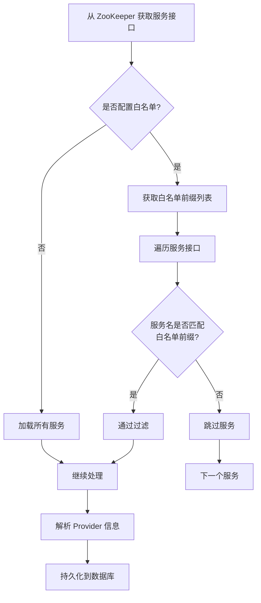

---

## 3. 服务注册与 MCP 生成流程

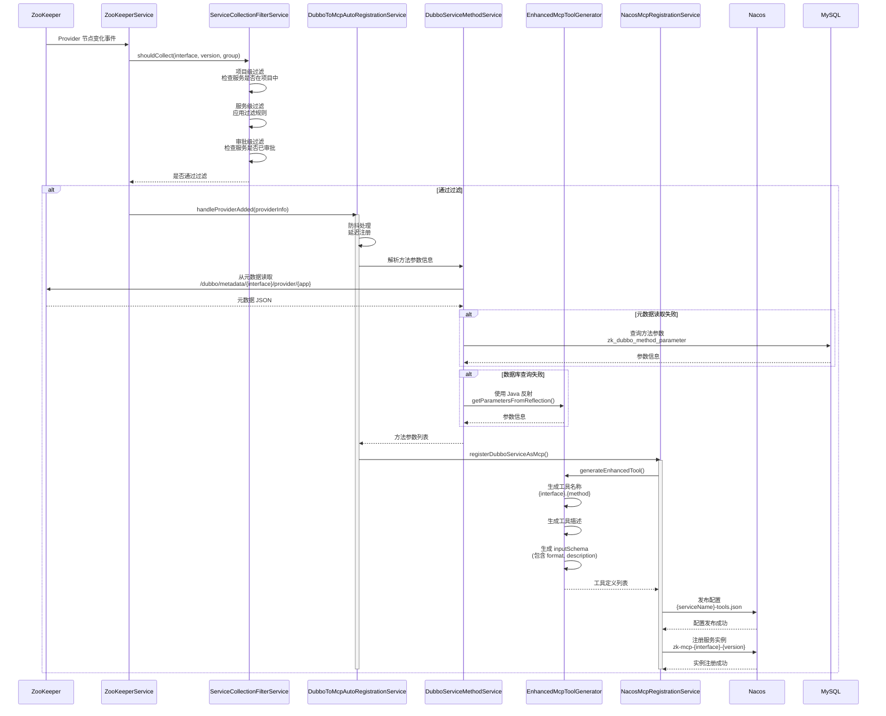

### 3.1 三层过滤机制详细流程

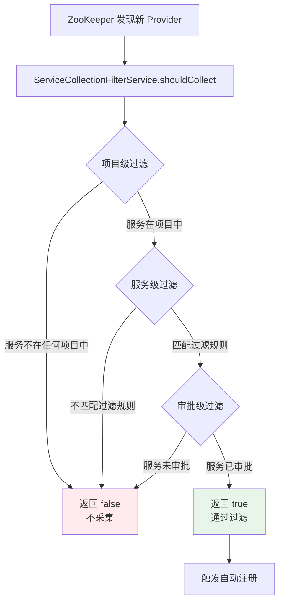

---

## 4. 虚拟项目编排流程

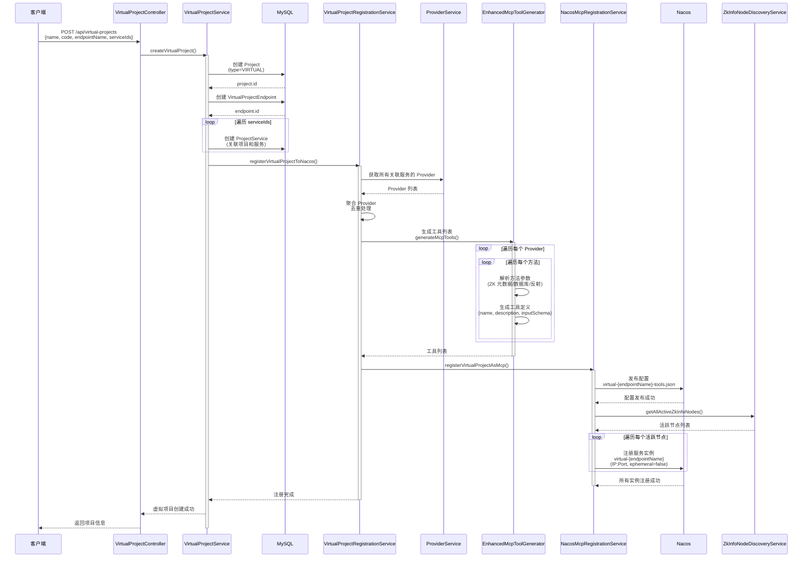

### 4.1 虚拟项目服务编排图

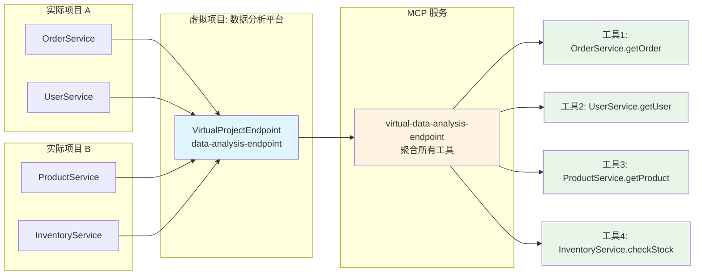

---

## 5. 参数解析与工具生成流程

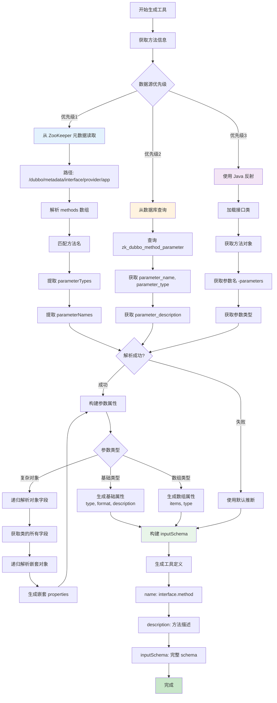

### 5.1 参数解析详细流程

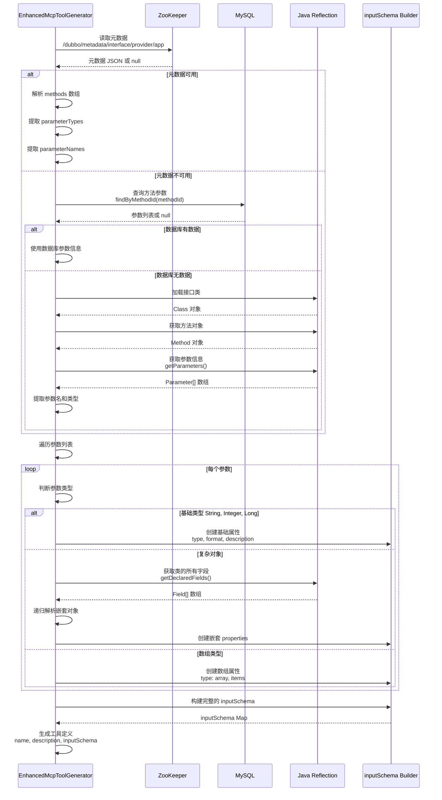

---

## 6. 外部调用链路

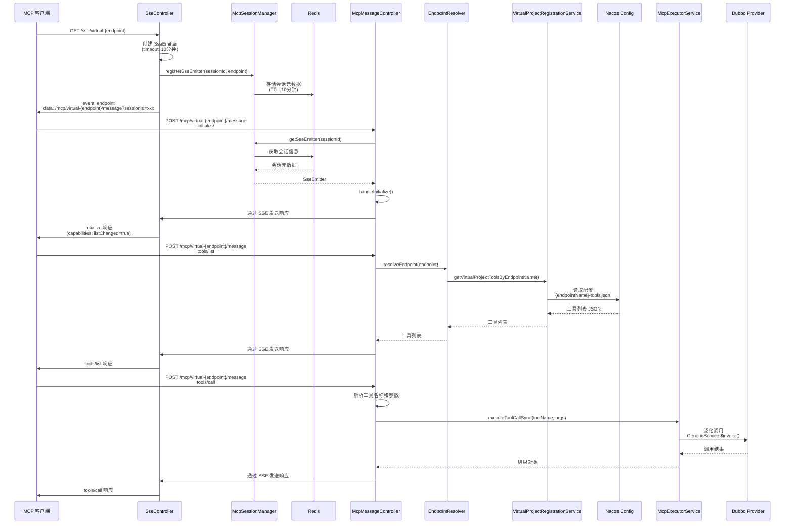

### 6.1 完整调用链路图

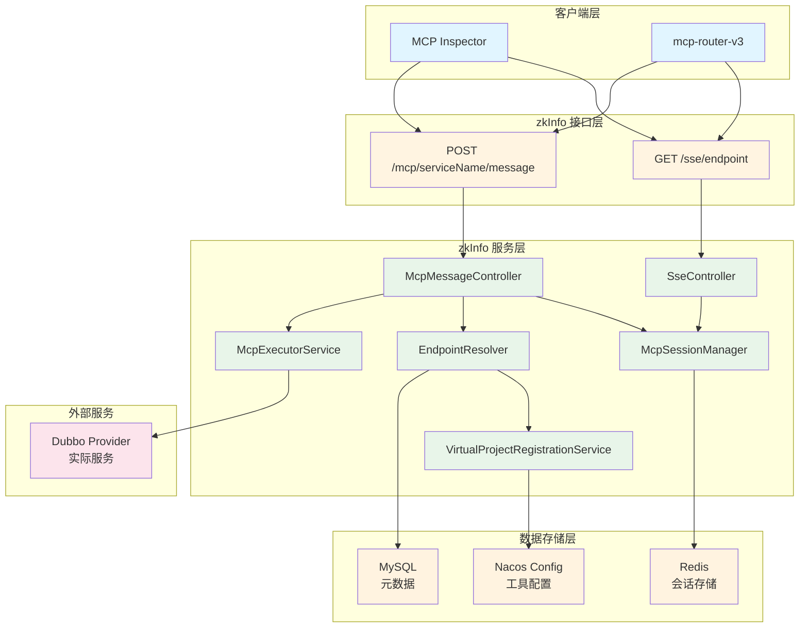

---

## 7. 数据流转图

### 7.1 完整数据流转图

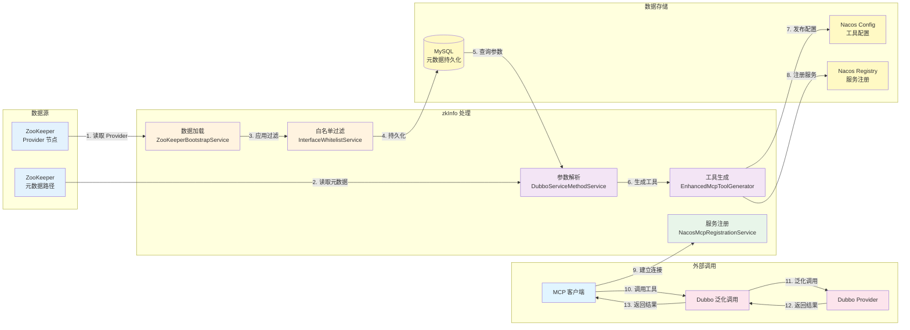

### 7.2 参数解析数据流

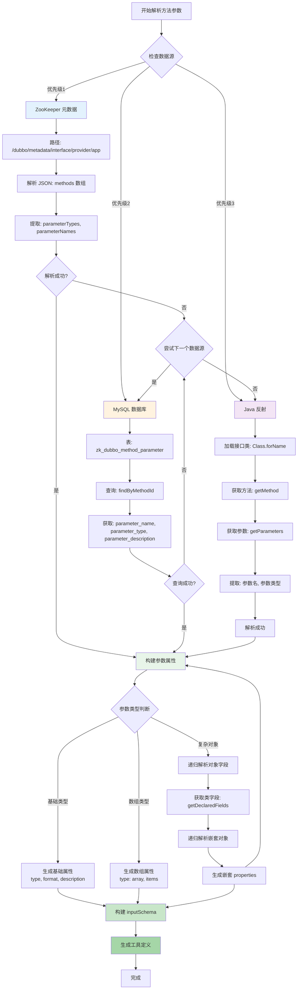

### 7.3 服务注册数据流

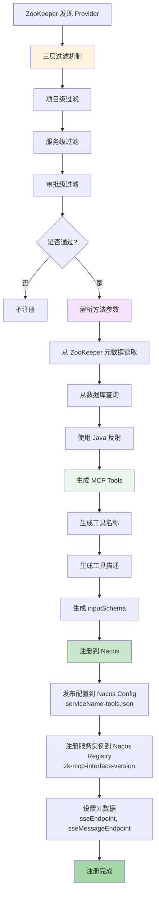

### 7.4 虚拟项目数据流

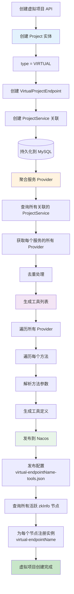

---

## 8. 核心功能时序图

### 8.1 完整启动时序图

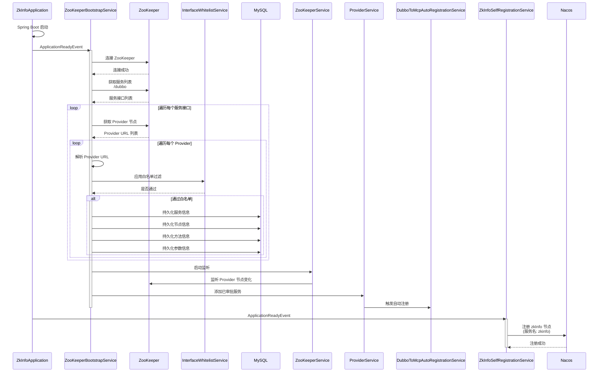

### 8.2 工具调用完整流程

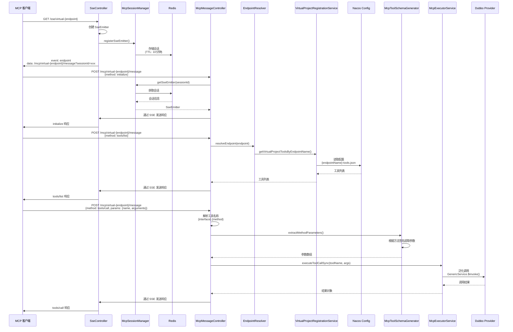

---

## 9. 数据表关系图

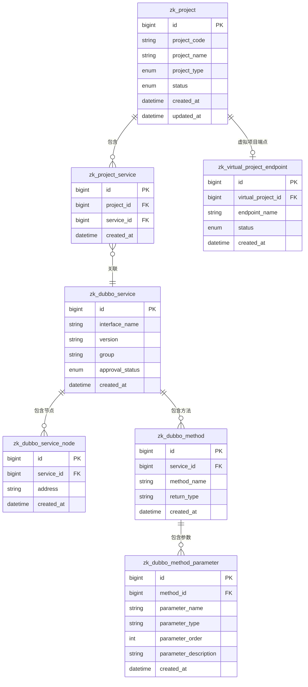

---

## 10. 组件交互图

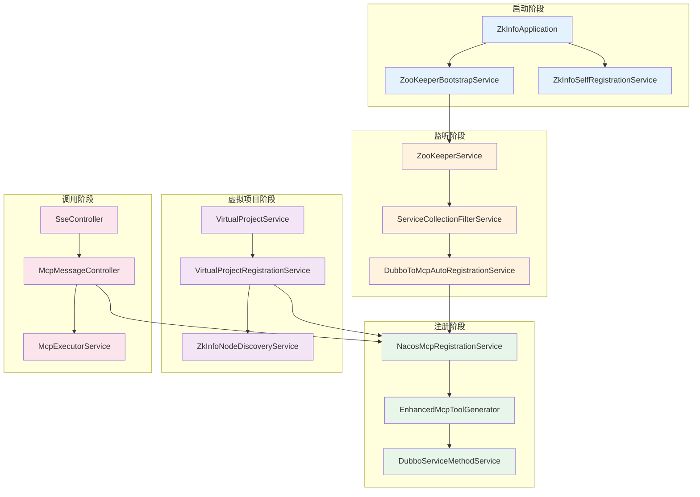

---

## 11. 关键配置与端点

### 11.1 配置项映射图

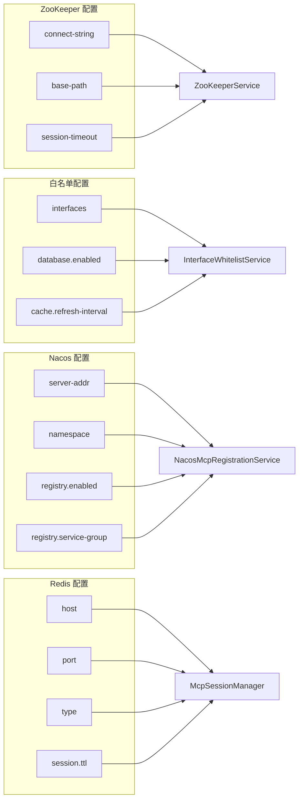

### 11.2 API 端点映射图

```mermaid
graph TB
    subgraph "SSE 端点"
        E1["GET /sse"]
        E2["GET /sse/endpoint"]
    end
    
    subgraph "MCP 消息端点"
        E3["POST /mcp/message"]
        E4["POST /mcp/serviceName/message"]
    end
    
    subgraph "虚拟项目管理端点"
        E5["POST /api/virtual-projects"]
        E6["GET /api/virtual-projects"]
        E7["GET /api/virtual-projects/endpointName/tools"]
        E8["DELETE /api/virtual-projects/id"]
    end
    
    subgraph "Dubbo 服务管理端点"
        E9["GET /api/dubbo-services"]
        E10["POST /api/dubbo-services/id/approve"]
    end
    
    E1 --> SseController
    E2 --> SseController
    E3 --> McpMessageController
    E4 --> McpMessageController
    E5 --> VirtualProjectController
    E6 --> VirtualProjectController
    E7 --> VirtualProjectController
    E8 --> VirtualProjectController
    E9 --> DubboServiceController
    E10 --> DubboServiceController
```

---

## 12. 状态转换图

### 12.1 服务状态转换

```mermaid
stateDiagram-v2
    [*] --> Discovered: ZooKeeper 发现 Provider
    Discovered --> WhitelistFilter: 应用白名单过滤
    WhitelistFilter --> Rejected: 不匹配白名单
    WhitelistFilter --> Pending: 匹配白名单
    
    Pending --> Persisted: 持久化到数据库
    Persisted --> Approved: 服务审批通过
    Persisted --> Rejected: 服务审批拒绝
    
    Approved --> Registered: 注册到 Nacos
    Registered --> Active: 服务可用
    
    Active --> Updated: Provider 节点变化
    Updated --> Active: 更新注册信息
    
    Active --> Removed: Provider 节点删除
    Removed --> [*]
    
    Rejected --> [*]
```

### 12.2 虚拟项目状态转换

```mermaid
stateDiagram-v2
    [*] --> Creating: POST /api/virtual-projects
    Creating --> Created: 数据库持久化成功
    Created --> Registering: 注册到 Nacos
    Registering --> Registered: Nacos 注册成功
    Registered --> Active: 服务可用
    
    Active --> Updating: 更新虚拟项目
    Updating --> Active: 更新完成
    
    Active --> Deleting: DELETE /api/virtual-projects
    Deleting --> Deleted: 从 Nacos 注销
    Deleted --> [*]
```

---

## 13. 性能优化点

### 13.1 数据加载优化

```mermaid
graph TD
    A[启动时批量加载] --> B[并行处理多个服务]
    B --> C[使用 ForkJoinPool]
    C --> D[减少网络往返]
    D --> E[批量持久化]
    E --> F[只监听已审批服务]
    
    style A fill:#e3f2fd
    style B fill:#fff3e0
    style C fill:#e8f5e9
```

### 13.2 缓存策略

```mermaid
graph LR
    A[白名单缓存] --> B[60秒刷新]
    C[会话缓存] --> D[Redis TTL: 10分钟]
    E[工具配置缓存] --> F[Nacos Config]
    G[服务发现缓存] --> H[内存缓存]
    
    style A fill:#e3f2fd
    style C fill:#fff3e0
    style E fill:#e8f5e9
    style G fill:#f3e5f5
```

---

---

## 14. 功能模块详细架构图

### 14.1 ZooKeeper 数据加载模块

```mermaid
graph TB
    subgraph "启动阶段"
        A1[ZkInfoApplication]
        A2[ApplicationReadyEvent]
        A3[ZooKeeperBootstrapService]
    end
    
    subgraph "ZooKeeper 连接"
        B1[ZooKeeperService.connect]
        B2[连接池管理]
        B3[会话管理]
    end
    
    subgraph "数据采集"
        C1[遍历 /dubbo 节点]
        C2[获取服务接口列表]
        C3[获取 Provider 节点]
        C4[解析 Provider URL]
    end
    
    subgraph "数据过滤"
        D1[InterfaceWhitelistService]
        D2[白名单前缀匹配]
        D3[缓存管理]
    end
    
    subgraph "数据持久化"
        E1[DubboServiceMapper]
        E2[DubboServiceNodeMapper]
        E3[DubboMethodMapper]
        E4[DubboMethodParameterMapper]
    end
    
    subgraph "监听机制"
        F1[启动节点监听]
        F2[Provider 变化事件]
        F3[自动触发注册]
    end
    
    A1 --> A2
    A2 --> A3
    A3 --> B1
    B1 --> B2
    B2 --> B3
    B3 --> C1
    C1 --> C2
    C2 --> C3
    C3 --> C4
    C4 --> D1
    D1 --> D2
    D2 --> D3
    D3 --> E1
    E1 --> E2
    E2 --> E3
    E3 --> E4
    E4 --> F1
    F1 --> F2
    F2 --> F3
    
    style A1 fill:#e3f2fd
    style B1 fill:#fff3e0
    style C1 fill:#e8f5e9
    style D1 fill:#f3e5f5
    style E1 fill:#fce4ec
    style F1 fill:#fff9c4
```

### 14.2 白名单过滤模块

```mermaid
flowchart TD
    Start[服务接口发现] --> Load[加载白名单配置]
    Load --> Check{是否启用白名单?}
    
    Check -->|否| Pass[通过所有服务]
    Check -->|是| GetList[获取白名单前缀列表]
    
    GetList --> Cache{检查缓存}
    Cache -->|命中| UseCache[使用缓存]
    Cache -->|未命中| QueryDB[查询数据库]
    
    QueryDB --> UpdateCache[更新缓存]
    UpdateCache --> UseCache
    UseCache --> Match[匹配服务名]
    
    Match --> Compare{服务名是否匹配<br/>白名单前缀?}
    Compare -->|是| Pass
    Compare -->|否| Reject[拒绝服务]
    
    Pass --> Next[继续处理]
    Reject --> Skip[跳过服务]
    
    style Load fill:#e3f2fd
    style GetList fill:#fff3e0
    style Match fill:#e8f5e9
    style Pass fill:#c8e6c9
    style Reject fill:#ffcdd2
```

### 14.3 服务注册模块

```mermaid
graph LR
    subgraph "服务发现"
        A1[ZooKeeper 监听]
        A2[Provider 节点变化]
        A3[触发注册事件]
    end
    
    subgraph "三层过滤"
        B1[项目级过滤]
        B2[服务级过滤]
        B3[审批级过滤]
    end
    
    subgraph "防抖处理"
        C1[延迟队列]
        C2[去重处理]
        C3[批量注册]
    end
    
    subgraph "参数解析"
        D1[ZooKeeper 元数据]
        D2[数据库查询]
        D3[Java 反射]
    end
    
    subgraph "工具生成"
        E1[EnhancedMcpToolGenerator]
        E2[生成工具定义]
        E3[构建 inputSchema]
    end
    
    subgraph "Nacos 注册"
        F1[发布配置]
        F2[注册服务实例]
        F3[设置元数据]
    end
    
    A1 --> A2
    A2 --> A3
    A3 --> B1
    B1 --> B2
    B2 --> B3
    B3 --> C1
    C1 --> C2
    C2 --> C3
    C3 --> D1
    D1 --> D2
    D2 --> D3
    D3 --> E1
    E1 --> E2
    E2 --> E3
    E3 --> F1
    F1 --> F2
    F2 --> F3
    
    style A1 fill:#e3f2fd
    style B1 fill:#fff3e0
    style C1 fill:#e8f5e9
    style D1 fill:#f3e5f5
    style E1 fill:#fce4ec
    style F1 fill:#fff9c4
```

### 14.4 工具生成模块

```mermaid
flowchart TD
    Start[开始生成工具] --> Input[输入: Provider 信息]
    Input --> Parse[解析方法签名]
    
    Parse --> Source{选择数据源}
    Source -->|优先级1| ZK[ZooKeeper 元数据]
    Source -->|优先级2| DB[数据库查询]
    Source -->|优先级3| Reflect[Java 反射]
    
    ZK --> Extract1[提取参数类型和名称]
    DB --> Extract2[提取参数描述]
    Reflect --> Extract3[提取参数信息]
    
    Extract1 --> Build
    Extract2 --> Build
    Extract3 --> Build
    
    Build[构建参数属性] --> Type{参数类型}
    Type -->|基础类型| Base[生成基础属性<br/>type, format, description]
    Type -->|复杂对象| Complex[递归解析对象字段]
    Type -->|数组类型| Array[生成数组属性]
    
    Complex --> Fields[获取类字段]
    Fields --> Nested[递归解析嵌套对象]
    Nested --> Props[生成嵌套 properties]
    Props --> Build
    
    Base --> Schema[构建 inputSchema]
    Array --> Schema
    Props --> Schema
    
    Schema --> Tool[生成工具定义]
    Tool --> Name[设置工具名称]
    Name --> Desc[设置工具描述]
    Desc --> Output[输出工具定义]
    
    style Parse fill:#e3f2fd
    style Source fill:#fff3e0
    style Build fill:#e8f5e9
    style Schema fill:#f3e5f5
    style Tool fill:#fce4ec
```

### 14.5 虚拟项目编排模块

```mermaid
graph TB
    subgraph "API 层"
        A1[VirtualProjectController]
        A2[创建请求]
        A3[参数验证]
    end
    
    subgraph "服务层"
        B1[VirtualProjectService]
        B2[创建 Project 实体]
        B3[创建 VirtualProjectEndpoint]
        B4[创建 ProjectService 关联]
    end
    
    subgraph "数据持久化"
        C1[ProjectMapper]
        C2[VirtualProjectEndpointMapper]
        C3[ProjectServiceMapper]
        C4[MySQL 数据库]
    end
    
    subgraph "服务聚合"
        D1[VirtualProjectRegistrationService]
        D2[查询关联服务]
        D3[获取所有 Provider]
        D4[去重处理]
    end
    
    subgraph "工具生成"
        E1[遍历 Provider]
        E2[遍历方法]
        E3[生成工具定义]
    end
    
    subgraph "Nacos 注册"
        F1[发布工具配置]
        F2[发现活跃节点]
        F3[注册服务实例]
    end
    
    A1 --> A2
    A2 --> A3
    A3 --> B1
    B1 --> B2
    B2 --> B3
    B3 --> B4
    B4 --> C1
    C1 --> C2
    C2 --> C3
    C3 --> C4
    C4 --> D1
    D1 --> D2
    D2 --> D3
    D3 --> D4
    D4 --> E1
    E1 --> E2
    E2 --> E3
    E3 --> F1
    F1 --> F2
    F2 --> F3
    
    style A1 fill:#e3f2fd
    style B1 fill:#fff3e0
    style C1 fill:#e8f5e9
    style D1 fill:#f3e5f5
    style E1 fill:#fce4ec
    style F1 fill:#fff9c4
```

### 14.6 SSE 连接管理模块

```mermaid
sequenceDiagram
    participant Client as MCP 客户端
    participant Controller as SseController
    participant Session as McpSessionManager
    participant Redis as Redis
    participant Cleanup as SessionCleanupService
    
    Client->>Controller: GET /sse/endpoint
    Controller->>Controller: 创建 SseEmitter<br/>(timeout: 10分钟)
    Controller->>Session: registerSseEmitter(sessionId, endpoint)
    Session->>Redis: 存储会话元数据<br/>(TTL: 10分钟)
    Controller->>Client: event: endpoint<br/>data: messageEndpoint URL
    
    Client->>Controller: POST /mcp/message
    Controller->>Session: getSseEmitter(sessionId)
    Session->>Redis: 获取会话信息
    Redis-->>Session: 会话元数据
    Session-->>Controller: SseEmitter
    Controller->>Controller: 通过 SSE 发送响应
    Controller->>Client: SSE 事件响应
    
    Note over Cleanup: 每分钟执行一次
    Cleanup->>Session: 查找过期会话<br/>(超过10分钟未活动)
    Session->>Redis: 查询所有会话
    Redis-->>Session: 会话列表
    Session->>Session: 过滤过期会话
    Session->>Session: 移除过期会话
    Session->>Redis: 删除过期会话
```

### 14.7 MCP 消息处理模块

```mermaid
flowchart TD
    Start[接收 MCP 消息] --> Parse[解析 JSON-RPC 请求]
    Parse --> Method{判断方法类型}
    
    Method -->|initialize| Init[处理初始化]
    Method -->|tools/list| ToolsList[处理工具列表]
    Method -->|tools/call| ToolCall[处理工具调用]
    Method -->|resources/list| ResourcesList[处理资源列表]
    Method -->|prompts/list| PromptsList[处理提示列表]
    Method -->|notifications/initialized| Notify[处理通知]
    
    Init --> InitResp[返回初始化响应]
    
    ToolsList --> Resolve[解析端点]
    Resolve --> GetTools[获取工具列表]
    GetTools --> ToolsResp[返回工具列表]
    
    ToolCall --> ParseTool[解析工具名称]
    ParseTool --> ExtractArgs[提取参数]
    ExtractArgs --> Execute[执行工具调用]
    Execute --> Dubbo[泛化调用 Dubbo]
    Dubbo --> ToolResp[返回调用结果]
    
    ResourcesList --> ResourcesResp[返回资源列表]
    PromptsList --> PromptsResp[返回提示列表]
    Notify --> NotifyResp[返回 202 Accepted]
    
    InitResp --> SSE[通过 SSE 发送响应]
    ToolsResp --> SSE
    ToolResp --> SSE
    ResourcesResp --> SSE
    PromptsResp --> SSE
    NotifyResp --> HTTP[直接 HTTP 响应]
    
    style Parse fill:#e3f2fd
    style Method fill:#fff3e0
    style Execute fill:#e8f5e9
    style SSE fill:#f3e5f5
```

---

## 15. 功能模块数据流图

### 15.1 ZooKeeper 数据加载数据流

```mermaid
flowchart LR
    ZK[(ZooKeeper)] -->|1. 连接| Connect[建立连接]
    Connect -->|2. 遍历| Traverse[遍历 /dubbo 节点]
    Traverse -->|3. 获取| Services[服务接口列表]
    Services -->|4. 获取| Providers[Provider 节点列表]
    Providers -->|5. 解析| Parse[解析 Provider URL]
    Parse -->|6. 过滤| Filter[白名单过滤]
    Filter -->|7. 持久化| Persist[持久化到数据库]
    Persist -->|8. 监听| Watch[启动节点监听]
    Watch -->|9. 事件| Event[Provider 变化事件]
    Event -->|10. 触发| Trigger[触发自动注册]
    
    style ZK fill:#e3f2fd
    style Connect fill:#fff3e0
    style Filter fill:#e8f5e9
    style Persist fill:#f3e5f5
    style Watch fill:#fce4ec
```

### 15.2 服务注册数据流

```mermaid
flowchart TD
    Event[Provider 变化事件] --> Filter[三层过滤机制]
    Filter -->|通过| Debounce[防抖处理]
    Filter -->|拒绝| End1[结束]
    
    Debounce --> Parse[解析方法参数]
    Parse --> Source{数据源}
    Source -->|ZK| ZKData[ZooKeeper 元数据]
    Source -->|DB| DBData[数据库查询]
    Source -->|Reflect| ReflectData[Java 反射]
    
    ZKData --> Generate[生成工具定义]
    DBData --> Generate
    ReflectData --> Generate
    
    Generate --> Build[构建 inputSchema]
    Build --> Publish[发布到 Nacos Config]
    Publish --> Register[注册到 Nacos Registry]
    Register --> End2[注册完成]
    
    style Event fill:#e3f2fd
    style Filter fill:#fff3e0
    style Parse fill:#e8f5e9
    style Generate fill:#f3e5f5
    style Register fill:#fce4ec
```

### 15.3 虚拟项目编排数据流

```mermaid
flowchart LR
    API[创建虚拟项目 API] --> Create[创建 Project]
    Create --> Endpoint[创建 Endpoint]
    Endpoint --> Service[创建 Service 关联]
    Service --> DB[(持久化到 MySQL)]
    DB --> Aggregate[聚合服务 Provider]
    Aggregate --> Dedup[去重处理]
    Dedup --> GenTools[生成工具列表]
    GenTools --> Publish[发布到 Nacos Config]
    Publish --> Discover[发现活跃节点]
    Discover --> Register[注册服务实例]
    Register --> Complete[虚拟项目创建完成]
    
    style API fill:#e3f2fd
    style Create fill:#fff3e0
    style DB fill:#e8f5e9
    style GenTools fill:#f3e5f5
    style Register fill:#fce4ec
```

### 15.4 SSE 连接管理数据流

```mermaid
flowchart TD
    Request[SSE 连接请求] --> Create[创建 SseEmitter]
    Create --> Session[注册会话]
    Session --> Redis[(存储到 Redis)]
    Redis --> Response[返回 messageEndpoint]
    Response --> Client[客户端]
    
    Client --> Message[MCP 消息请求]
    Message --> GetSession[获取会话]
    GetSession --> Redis
    Redis --> Emitter[获取 SseEmitter]
    Emitter --> Send[发送 SSE 事件]
    Send --> Client
    
    Note[定时清理任务] --> Check[检查过期会话]
    Check --> Redis
    Redis --> Remove[移除过期会话]
    
    style Request fill:#e3f2fd
    style Session fill:#fff3e0
    style Redis fill:#e8f5e9
    style Send fill:#f3e5f5
    style Check fill:#fce4ec
```

### 15.5 MCP 工具调用数据流

```mermaid
flowchart LR
    Request[工具调用请求] --> Parse[解析工具名称]
    Parse --> Extract[提取参数]
    Extract --> Validate[参数验证]
    Validate --> Exec[执行工具调用]
    Exec --> Dubbo[泛化调用 Dubbo]
    Dubbo --> Result[获取调用结果]
    Result --> Transform[结果转换]
    Transform --> Response[返回响应]
    Response --> SSE[通过 SSE 发送]
    
    style Request fill:#e3f2fd
    style Parse fill:#fff3e0
    style Exec fill:#e8f5e9
    style Dubbo fill:#f3e5f5
    style Response fill:#fce4ec
```

### 15.6 参数解析数据流

```mermaid
flowchart TD
    Method[方法信息] --> Try1[尝试 ZooKeeper 元数据]
    Try1 -->|成功| ZKData[使用 ZK 数据]
    Try1 -->|失败| Try2[尝试数据库查询]
    
    Try2 -->|成功| DBData[使用数据库数据]
    Try2 -->|失败| Try3[使用 Java 反射]
    
    Try3 --> ReflectData[使用反射数据]
    
    ZKData --> Build[构建参数属性]
    DBData --> Build
    ReflectData --> Build
    
    Build --> Type{参数类型}
    Type -->|基础类型| Base[基础属性]
    Type -->|复杂对象| Complex[递归解析]
    Type -->|数组类型| Array[数组属性]
    
    Complex --> Fields[获取字段]
    Fields --> Nested[嵌套解析]
    Nested --> Build
    
    Base --> Schema[inputSchema]
    Array --> Schema
    Build --> Schema
    
    style Method fill:#e3f2fd
    style Try1 fill:#fff3e0
    style Build fill:#e8f5e9
    style Schema fill:#f3e5f5
```

---

## 16. 模块间交互图

### 16.1 核心模块交互

```mermaid
graph TB
    subgraph "数据采集模块"
        M1[ZooKeeperBootstrapService]
        M2[ZooKeeperService]
        M3[InterfaceWhitelistService]
    end
    
    subgraph "服务注册模块"
        M4[ServiceCollectionFilterService]
        M5[DubboToMcpAutoRegistrationService]
        M6[NacosMcpRegistrationService]
    end
    
    subgraph "工具生成模块"
        M7[EnhancedMcpToolGenerator]
        M8[DubboServiceMethodService]
        M9[MethodSignatureResolver]
    end
    
    subgraph "虚拟项目模块"
        M10[VirtualProjectService]
        M11[VirtualProjectRegistrationService]
        M12[ZkInfoNodeDiscoveryService]
    end
    
    subgraph "连接管理模块"
        M13[SseController]
        M14[McpSessionManager]
        M15[SessionCleanupService]
    end
    
    subgraph "消息处理模块"
        M16[McpMessageController]
        M17[EndpointResolver]
        M18[McpExecutorService]
    end
    
    M1 --> M2
    M2 --> M3
    M3 --> M4
    M4 --> M5
    M5 --> M6
    M6 --> M7
    M7 --> M8
    M8 --> M9
    M10 --> M11
    M11 --> M6
    M11 --> M12
    M13 --> M14
    M14 --> M15
    M16 --> M14
    M16 --> M17
    M16 --> M18
    M17 --> M11
    
    style M1 fill:#e3f2fd
    style M4 fill:#fff3e0
    style M7 fill:#e8f5e9
    style M10 fill:#f3e5f5
    style M13 fill:#fce4ec
    style M16 fill:#fff9c4
```

### 16.2 数据流向图

```mermaid
flowchart LR
    subgraph "数据源"
        DS1[ZooKeeper]
        DS2[MySQL]
        DS3[Redis]
        DS4[Nacos]
    end
    
    subgraph "处理层"
        P1[数据采集]
        P2[数据过滤]
        P3[数据转换]
        P4[数据注册]
    end
    
    subgraph "存储层"
        S1[MySQL 持久化]
        S2[Redis 缓存]
        S3[Nacos 配置]
        S4[Nacos 注册]
    end
    
    subgraph "服务层"
        SV1[SSE 连接]
        SV2[MCP 消息]
        SV3[工具调用]
    end
    
    DS1 --> P1
    DS2 --> P2
    P1 --> P2
    P2 --> P3
    P3 --> P4
    P4 --> S1
    P4 --> S3
    P4 --> S4
    S1 --> SV2
    S2 --> SV1
    S3 --> SV2
    S4 --> SV2
    SV1 --> SV2
    SV2 --> SV3
    
    style DS1 fill:#e3f2fd
    style P1 fill:#fff3e0
    style S1 fill:#e8f5e9
    style SV1 fill:#f3e5f5
```

---

---

## 17. 核心节点详细架构图

### 17.1 ZooKeeperBootstrapService 核心节点

```mermaid
graph TB
    subgraph "入口层"
        A1[ApplicationReadyEvent]
        A2[bootstrapZooKeeperData]
    end
    
    subgraph "数据采集层"
        B1[loadAllProvidersFromZooKeeper]
        B2[并行流处理]
        B3[ForkJoinPool]
        B4[遍历 /dubbo 节点]
        B5[获取 Provider 列表]
    end
    
    subgraph "数据过滤层"
        C1[InterfaceWhitelistService]
        C2[白名单前缀匹配]
        C3[缓存管理]
    end
    
    subgraph "数据持久化层"
        D1[persistProvidersByInterface]
        D2[DubboServiceDbService]
        D3[ProviderInfoDbService]
        D4[DubboServiceMethodService]
        D5[MySQL 数据库]
    end
    
    subgraph "监听启动层"
        E1[startWatchingProviders]
        E2[ZooKeeperService]
        E3[PathChildrenCache]
    end
    
    subgraph "服务注册层"
        F1[addApprovedProvidersToService]
        F2[ProviderService]
        F3[触发自动注册]
    end
    
    A1 --> A2
    A2 --> B1
    B1 --> B2
    B2 --> B3
    B3 --> B4
    B4 --> B5
    B5 --> C1
    C1 --> C2
    C2 --> C3
    C3 --> D1
    D1 --> D2
    D2 --> D3
    D3 --> D4
    D4 --> D5
    D5 --> E1
    E1 --> E2
    E2 --> E3
    E3 --> F1
    F1 --> F2
    F2 --> F3
    
    style A1 fill:#e3f2fd
    style B1 fill:#fff3e0
    style C1 fill:#e8f5e9
    style D1 fill:#f3e5f5
    style E1 fill:#fce4ec
    style F1 fill:#fff9c4
```

#### 17.1.1 ZooKeeperBootstrapService 数据流

```mermaid
flowchart LR
    Event[ApplicationReadyEvent] --> Start[启动异步任务]
    Start --> Load[批量拉取 Provider]
    Load --> Parallel[并行处理服务接口]
    Parallel --> Filter[白名单过滤]
    Filter --> Group[按接口分组]
    Group --> Persist[持久化到数据库]
    Persist --> Watch[启动监听]
    Watch --> Register[添加已审批服务]
    Register --> Complete[初始化完成]
    
    style Event fill:#e3f2fd
    style Load fill:#fff3e0
    style Filter fill:#e8f5e9
    style Persist fill:#f3e5f5
    style Watch fill:#fce4ec
```

### 17.2 ServiceCollectionFilterService 核心节点

```mermaid
graph TB
    subgraph "入口层"
        A1[shouldCollect]
        A2[输入: interface, version, group]
    end
    
    subgraph "项目级过滤"
        B1[isInDefinedProjects]
        B2[ProjectManagementService]
        B3[projectServiceCache]
        B4[查询数据库]
    end
    
    subgraph "服务级过滤"
        C1[isFilteredOut]
        C2[FilterRule 匹配]
        C3[包含规则检查]
        C4[排除规则检查]
        C5[正则表达式匹配]
    end
    
    subgraph "审批级过滤"
        D1[isApproved]
        D2[approvedServicesCache]
        D3[查询审批状态]
        D4[ApprovalStatus 检查]
    end
    
    subgraph "缓存管理"
        E1[刷新项目服务缓存]
        E2[刷新审批服务缓存]
        E3[刷新过滤规则缓存]
    end
    
    A1 --> B1
    B1 --> B2
    B2 --> B3
    B3 --> B4
    B4 --> C1
    C1 --> C2
    C2 --> C3
    C3 --> C4
    C4 --> C5
    C5 --> D1
    D1 --> D2
    D2 --> D3
    D3 --> D4
    D4 --> E1
    E1 --> E2
    E2 --> E3
    
    style A1 fill:#e3f2fd
    style B1 fill:#fff3e0
    style C1 fill:#e8f5e9
    style D1 fill:#f3e5f5
    style E1 fill:#fce4ec
```

#### 17.2.1 ServiceCollectionFilterService 数据流

```mermaid
flowchart TD
    Input[服务信息输入] --> Check1{项目级过滤}
    Check1 -->|不在项目中| Reject1[拒绝]
    Check1 -->|在项目中| Check2{服务级过滤}
    Check2 -->|匹配排除规则| Reject2[拒绝]
    Check2 -->|匹配包含规则| Check3{审批级过滤}
    Check3 -->|未审批| Reject3[拒绝]
    Check3 -->|已审批| Accept[通过]
    
    Reject1 --> End[结束]
    Reject2 --> End
    Reject3 --> End
    Accept --> Next[继续处理]
    
    style Input fill:#e3f2fd
    style Check1 fill:#fff3e0
    style Check2 fill:#e8f5e9
    style Check3 fill:#f3e5f5
    style Accept fill:#c8e6c9
    style Reject1 fill:#ffcdd2
    style Reject2 fill:#ffcdd2
    style Reject3 fill:#ffcdd2
```

### 17.3 EnhancedMcpToolGenerator 核心节点

```mermaid
graph TB
    subgraph "入口层"
        A1[generateEnhancedTool]
        A2[输入: ProviderInfo, Method]
    end
    
    subgraph "参数解析层"
        B1[getParametersFromReflection]
        B2[getParametersFromDatabase]
        B3[getParametersFromZooKeeper]
        B4[优先级选择]
    end
    
    subgraph "类型处理层"
        C1[判断参数类型]
        C2[基础类型处理]
        C3[复杂对象处理]
        C4[数组类型处理]
    end
    
    subgraph "字段解析层"
        D1[getClassFieldsFromReflection]
        D2[递归解析嵌套对象]
        D3[生成嵌套 properties]
    end
    
    subgraph "Schema 构建层"
        E1[createEnhancedParameterProperty]
        E2[构建 type, format, description]
        E3[设置 additionalProperties: false]
        E4[构建 inputSchema]
    end
    
    subgraph "工具定义层"
        F1[生成工具名称]
        F2[生成工具描述]
        F3[组合工具定义]
    end
    
    A1 --> B1
    B1 --> B2
    B2 --> B3
    B3 --> B4
    B4 --> C1
    C1 --> C2
    C1 --> C3
    C1 --> C4
    C3 --> D1
    D1 --> D2
    D2 --> D3
    D3 --> E1
    C2 --> E1
    C4 --> E1
    E1 --> E2
    E2 --> E3
    E3 --> E4
    E4 --> F1
    F1 --> F2
    F2 --> F3
    
    style A1 fill:#e3f2fd
    style B1 fill:#fff3e0
    style C1 fill:#e8f5e9
    style D1 fill:#f3e5f5
    style E1 fill:#fce4ec
    style F1 fill:#fff9c4
```

#### 17.3.1 EnhancedMcpToolGenerator 数据流

```mermaid
flowchart TD
    Start[开始生成工具] --> Try1[尝试反射获取参数]
    Try1 -->|成功| UseReflect[使用反射数据]
    Try1 -->|失败| Try2[尝试数据库查询]
    Try2 -->|成功| UseDB[使用数据库数据]
    Try2 -->|失败| Try3[尝试 ZooKeeper 元数据]
    Try3 -->|成功| UseZK[使用 ZK 数据]
    Try3 -->|失败| Fallback[使用默认推断]
    
    UseReflect --> Build[构建参数属性]
    UseDB --> Build
    UseZK --> Build
    Fallback --> Build
    
    Build --> Type{参数类型}
    Type -->|基础类型| Base[生成基础属性]
    Type -->|复杂对象| Complex[递归解析字段]
    Type -->|数组类型| Array[生成数组属性]
    
    Complex --> Fields[获取类字段]
    Fields --> Nested[递归解析]
    Nested --> Build
    
    Base --> Schema[构建 inputSchema]
    Array --> Schema
    Build --> Schema
    
    Schema --> Tool[生成工具定义]
    
    style Start fill:#e3f2fd
    style Try1 fill:#fff3e0
    style Build fill:#e8f5e9
    style Schema fill:#f3e5f5
    style Tool fill:#fce4ec
```

### 17.4 NacosMcpRegistrationService 核心节点

```mermaid
graph TB
    subgraph "入口层"
        A1[registerDubboServiceAsMcp]
        A2[registerVirtualProjectAsMcp]
    end
    
    subgraph "工具生成层"
        B1[generateMcpTools]
        B2[EnhancedMcpToolGenerator]
        B3[McpToolSchemaGenerator]
        B4[工具列表构建]
    end
    
    subgraph "配置发布层"
        C1[publishConfigsToNacos]
        C2[构建 tools.json]
        C3[构建 versions.json]
        C4[发布到 Nacos Config]
    end
    
    subgraph "实例注册层"
        D1[registerInstanceToNacos]
        D2[buildInstanceMetadata]
        D3[设置 sseEndpoint]
        D4[设置 sseMessageEndpoint]
        D5[注册到 Nacos Registry]
    end
    
    subgraph "多节点注册层"
        E1[registerInstancesToNacosForAllNodes]
        E2[ZkInfoNodeDiscoveryService]
        E3[获取活跃节点列表]
        E4[为每个节点注册实例]
    end
    
    A1 --> B1
    A2 --> B1
    B1 --> B2
    B2 --> B3
    B3 --> B4
    B4 --> C1
    C1 --> C2
    C2 --> C3
    C3 --> C4
    C4 --> D1
    D1 --> D2
    D2 --> D3
    D3 --> D4
    D4 --> D5
    A2 --> E1
    E1 --> E2
    E2 --> E3
    E3 --> E4
    E4 --> D1
    
    style A1 fill:#e3f2fd
    style B1 fill:#fff3e0
    style C1 fill:#e8f5e9
    style D1 fill:#f3e5f5
    style E1 fill:#fce4ec
```

#### 17.4.1 NacosMcpRegistrationService 数据流

```mermaid
flowchart LR
    Input[服务信息输入] --> GenTools[生成工具列表]
    GenTools --> BuildConfig[构建配置 JSON]
    BuildConfig --> PublishConfig[发布到 Nacos Config]
    PublishConfig --> BuildMetadata[构建实例元数据]
    BuildMetadata --> RegisterInstance[注册服务实例]
    RegisterInstance --> Complete[注册完成]
    
    style Input fill:#e3f2fd
    style GenTools fill:#fff3e0
    style PublishConfig fill:#e8f5e9
    style RegisterInstance fill:#f3e5f5
    style Complete fill:#c8e6c9
```

### 17.5 VirtualProjectRegistrationService 核心节点

```mermaid
graph TB
    subgraph "入口层"
        A1[registerVirtualProjectToNacos]
        A2[输入: VirtualProjectInfo]
    end
    
    subgraph "服务聚合层"
        B1[aggregateProviders]
        B2[查询关联服务]
        B3[获取所有 Provider]
        B4[去重处理]
    end
    
    subgraph "工具生成层"
        C1[generateMcpTools]
        C2[遍历 Provider]
        C3[遍历方法]
        C4[EnhancedMcpToolGenerator]
        C5[生成工具定义]
    end
    
    subgraph "Nacos 注册层"
        D1[registerVirtualProjectAsMcp]
        D2[NacosMcpRegistrationService]
        D3[发布工具配置]
        D4[注册服务实例]
    end
    
    subgraph "多节点处理层"
        E1[ZkInfoNodeDiscoveryService]
        E2[获取所有活跃节点]
        E3[为每个节点注册实例]
    end
    
    A1 --> B1
    B1 --> B2
    B2 --> B3
    B3 --> B4
    B4 --> C1
    C1 --> C2
    C2 --> C3
    C3 --> C4
    C4 --> C5
    C5 --> D1
    D1 --> D2
    D2 --> D3
    D3 --> D4
    D4 --> E1
    E1 --> E2
    E2 --> E3
    
    style A1 fill:#e3f2fd
    style B1 fill:#fff3e0
    style C1 fill:#e8f5e9
    style D1 fill:#f3e5f5
    style E1 fill:#fce4ec
```

#### 17.5.1 VirtualProjectRegistrationService 数据流

```mermaid
flowchart TD
    Start[虚拟项目信息] --> Aggregate[聚合服务 Provider]
    Aggregate --> Dedup[去重处理]
    Dedup --> GenTools[生成工具列表]
    GenTools --> Publish[发布到 Nacos Config]
    Publish --> Discover[发现活跃节点]
    Discover --> Register[注册服务实例]
    Register --> Complete[虚拟项目注册完成]
    
    style Start fill:#e3f2fd
    style Aggregate fill:#fff3e0
    style GenTools fill:#e8f5e9
    style Publish fill:#f3e5f5
    style Register fill:#fce4ec
    style Complete fill:#c8e6c9
```

### 17.6 McpSessionManager 核心节点

```mermaid
graph TB
    subgraph "会话注册层"
        A1[registerSseEmitter]
        A2[创建 SessionMeta]
        A3[存储到 Redis]
    end
    
    subgraph "会话获取层"
        B1[getSseEmitter]
        B2[从 Redis 获取]
        B3[验证会话有效性]
        B4[返回 SseEmitter]
    end
    
    subgraph "会话管理层"
        C1[getEndpointForSession]
        C2[getServiceName]
        C3[更新会话信息]
        C4[移除会话]
    end
    
    subgraph "Redis 存储层"
        D1[SessionRedisRepository]
        D2[存储会话元数据]
        D3[设置 TTL]
        D4[查询会话信息]
    end
    
    subgraph "清理任务层"
        E1[SessionCleanupService]
        E2[定时扫描]
        E3[查找过期会话]
        E4[清理过期会话]
    end
    
    A1 --> A2
    A2 --> A3
    A3 --> D1
    D1 --> D2
    D2 --> D3
    B1 --> B2
    B2 --> D4
    D4 --> B3
    B3 --> B4
    C1 --> D4
    C2 --> D4
    C3 --> D2
    C4 --> D1
    E1 --> E2
    E2 --> E3
    E3 --> D4
    E4 --> D1
    
    style A1 fill:#e3f2fd
    style B1 fill:#fff3e0
    style C1 fill:#e8f5e9
    style D1 fill:#f3e5f5
    style E1 fill:#fce4ec
```

#### 17.6.1 McpSessionManager 数据流

```mermaid
flowchart LR
    Register[注册会话] --> Create[创建 SessionMeta]
    Create --> Store[存储到 Redis]
    Store --> TTL[设置 TTL: 10分钟]
    
    Get[获取会话] --> Query[查询 Redis]
    Query --> Validate[验证有效性]
    Validate --> Return[返回 SseEmitter]
    
    Update[更新会话] --> Store
    Remove[移除会话] --> Delete[删除 Redis 键]
    
    Cleanup[定时清理] --> Scan[扫描所有会话]
    Scan --> Filter[过滤过期会话]
    Filter --> Delete
    
    style Register fill:#e3f2fd
    style Get fill:#fff3e0
    style Store fill:#e8f5e9
    style Cleanup fill:#f3e5f5
```

### 17.7 McpMessageController 核心节点

```mermaid
graph TB
    subgraph "请求接收层"
        A1[handleMessage]
        A2[handleMessageWithPath]
        A3[解析 JSON-RPC 请求]
    end
    
    subgraph "端点解析层"
        B1[EndpointResolver]
        B2[从参数获取]
        B3[从会话获取]
        B4[从缓存获取]
    end
    
    subgraph "方法路由层"
        C1[handleInitialize]
        C2[handleToolsList]
        C3[handleToolCall]
        C4[handleResourcesList]
        C5[handlePromptsList]
    end
    
    subgraph "工具调用层"
        D1[McpExecutorService]
        D2[解析工具名称]
        D3[提取参数]
        D4[泛化调用 Dubbo]
    end
    
    subgraph "响应发送层"
        E1[通过 SSE 发送]
        E2[直接 HTTP 响应]
        E3[构建 JSON-RPC 响应]
    end
    
    A1 --> A3
    A2 --> A3
    A3 --> B1
    B1 --> B2
    B2 --> B3
    B3 --> B4
    B4 --> C1
    B4 --> C2
    B4 --> C3
    B4 --> C4
    B4 --> C5
    C3 --> D1
    D1 --> D2
    D2 --> D3
    D3 --> D4
    C1 --> E1
    C2 --> E1
    C3 --> E1
    C4 --> E1
    C5 --> E1
    E1 --> E3
    E2 --> E3
    
    style A1 fill:#e3f2fd
    style B1 fill:#fff3e0
    style C1 fill:#e8f5e9
    style D1 fill:#f3e5f5
    style E1 fill:#fce4ec
```

#### 17.7.1 McpMessageController 数据流

```mermaid
flowchart TD
    Request[接收请求] --> Parse[解析 JSON-RPC]
    Parse --> Resolve[解析端点]
    Resolve --> Route{路由方法}
    
    Route -->|initialize| Init[处理初始化]
    Route -->|tools/list| ToolsList[处理工具列表]
    Route -->|tools/call| ToolCall[处理工具调用]
    Route -->|resources/list| ResourcesList[处理资源列表]
    Route -->|prompts/list| PromptsList[处理提示列表]
    
    ToolCall --> Exec[执行工具调用]
    Exec --> Dubbo[泛化调用 Dubbo]
    Dubbo --> Result[获取结果]
    
    Init --> Response[构建响应]
    ToolsList --> Response
    Result --> Response
    ResourcesList --> Response
    PromptsList --> Response
    
    Response --> SSE{是否有 SSE?}
    SSE -->|是| SendSSE[通过 SSE 发送]
    SSE -->|否| SendHTTP[直接 HTTP 响应]
    
    style Request fill:#e3f2fd
    style Parse fill:#fff3e0
    style Route fill:#e8f5e9
    style Exec fill:#f3e5f5
    style Response fill:#fce4ec
```

---

## 18. 核心节点时序图

### 18.1 ZooKeeperBootstrapService 启动时序

```mermaid
sequenceDiagram
    participant App as ZkInfoApplication
    participant Bootstrap as ZooKeeperBootstrapService
    participant ZK as ZooKeeperService
    participant Filter as InterfaceWhitelistService
    participant DB as Database Services
    participant Watch as ZooKeeperService
    
    App->>Bootstrap: ApplicationReadyEvent
    activate Bootstrap
    
    Bootstrap->>Bootstrap: 异步执行
    Bootstrap->>ZK: loadAllProvidersFromZooKeeper
    ZK->>ZK: 遍历 /dubbo 节点
    ZK->>ZK: 获取 Provider 列表
    ZK-->>Bootstrap: Provider 列表
    
    loop 每个 Provider
        Bootstrap->>Filter: 应用白名单过滤
        Filter-->>Bootstrap: 是否通过
        
        alt 通过过滤
            Bootstrap->>DB: 持久化服务信息
            Bootstrap->>DB: 持久化节点信息
            Bootstrap->>DB: 持久化方法信息
            Bootstrap->>DB: 持久化参数信息
        end
    end
    
    Bootstrap->>Watch: startWatchingProviders
    Watch->>Watch: 启动节点监听
    
    Bootstrap->>Bootstrap: addApprovedProvidersToService
    Bootstrap->>Bootstrap: 触发自动注册
    
    deactivate Bootstrap
```

### 18.2 ServiceCollectionFilterService 过滤时序

```mermaid
sequenceDiagram
    participant Caller as 调用者
    participant Filter as ServiceCollectionFilterService
    participant Project as ProjectManagementService
    participant DB as Database
    participant Cache as 缓存
    
    Caller->>Filter: shouldCollect(interface, version, group)
    activate Filter
    
    Filter->>Filter: 检查 filterEnabled
    
    Filter->>Project: isInDefinedProjects
    Project->>Cache: 检查项目服务缓存
    Cache-->>Project: 缓存结果或 null
    
    alt 缓存未命中
        Project->>DB: 查询数据库
        DB-->>Project: 项目服务列表
        Project->>Cache: 更新缓存
    end
    
    Project-->>Filter: 是否在项目中
    
    alt 在项目中
        Filter->>Filter: isFilteredOut
        Filter->>Filter: 应用过滤规则
        
        Filter->>DB: 查询审批状态
        DB-->>Filter: 审批信息
        
        Filter->>Filter: isApproved
        Filter-->>Caller: 返回 true/false
    else 不在项目中
        Filter-->>Caller: 返回 false
    end
    
    deactivate Filter
```

### 18.3 EnhancedMcpToolGenerator 工具生成时序

```mermaid
sequenceDiagram
    participant Caller as 调用者
    participant Gen as EnhancedMcpToolGenerator
    participant Reflect as Java Reflection
    participant DB as Database
    participant ZK as ZooKeeper
    
    Caller->>Gen: generateEnhancedTool(provider, method)
    activate Gen
    
    Gen->>Gen: 尝试反射获取参数
    Gen->>Reflect: 加载接口类
    Reflect-->>Gen: Class 对象
    
    alt 反射成功
        Gen->>Reflect: 获取方法参数
        Reflect-->>Gen: Parameter[] 数组
        Gen->>Gen: 提取参数信息
    else 反射失败
        Gen->>DB: 查询方法参数
        DB-->>Gen: 参数列表或 null
        
        alt 数据库有数据
            Gen->>Gen: 使用数据库参数
        else 数据库无数据
            Gen->>ZK: 读取元数据
            ZK-->>Gen: 元数据或 null
            Gen->>Gen: 使用默认推断
        end
    end
    
    Gen->>Gen: 遍历参数列表
    
    loop 每个参数
        Gen->>Gen: 判断参数类型
        
        alt 复杂对象
            Gen->>Reflect: 获取类字段
            Reflect-->>Gen: Field[] 数组
            Gen->>Gen: 递归解析嵌套对象
        end
        
        Gen->>Gen: 创建参数属性
    end
    
    Gen->>Gen: 构建 inputSchema
    Gen->>Gen: 生成工具定义
    Gen-->>Caller: 返回工具定义
    
    deactivate Gen
```

---

**文档版本**: 1.0.0  
**最后更新**: 2025-01-XX  
**维护者**: zkInfo Team

**注意**: 本文档使用 Mermaid 图表语法，可以在支持 Mermaid 的 Markdown 查看器中渲染（如 GitHub、GitLab、VS Code 等）。

