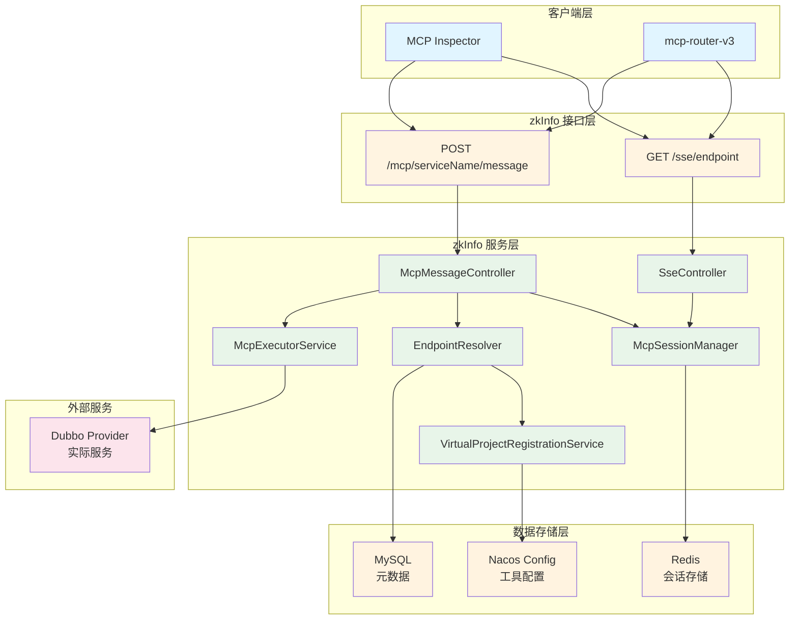
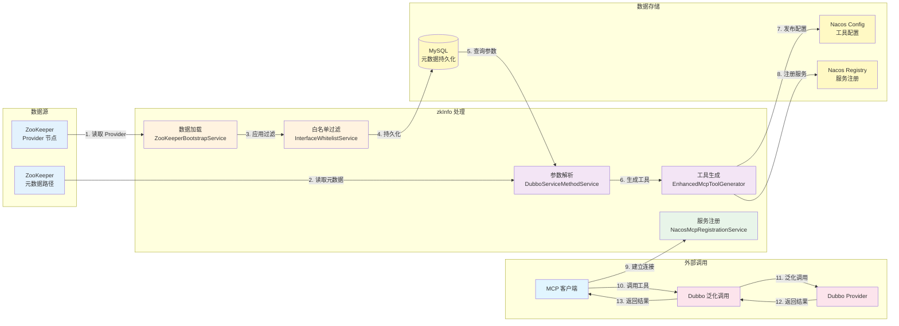
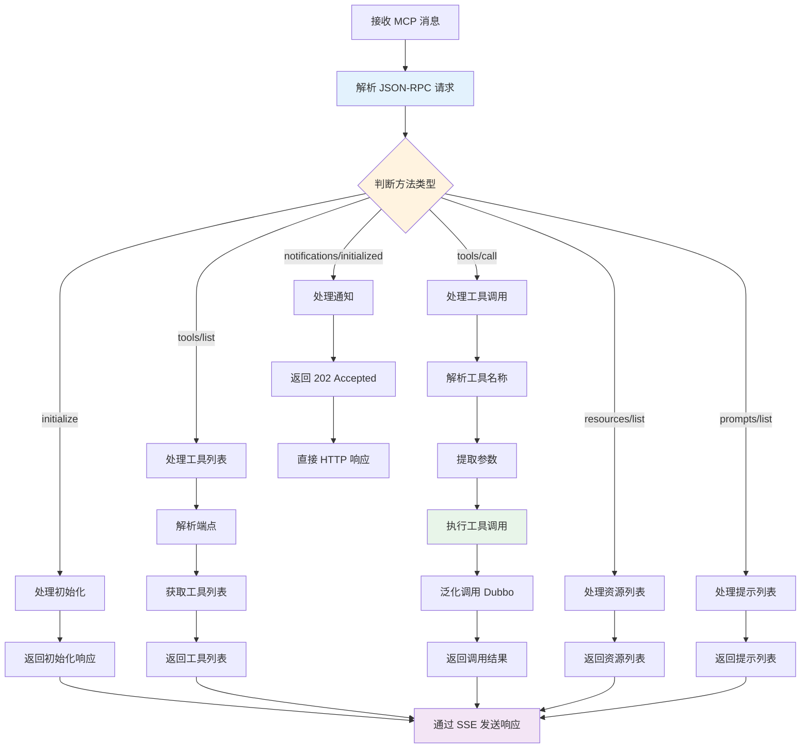
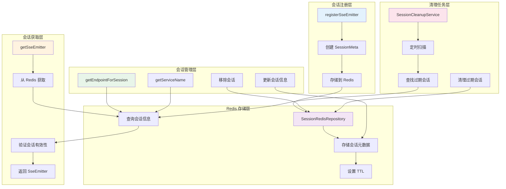
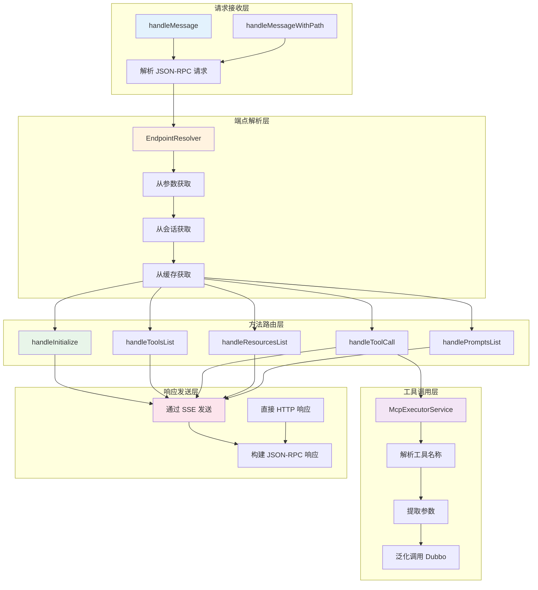
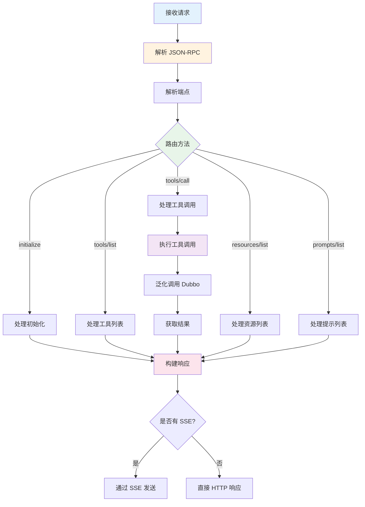

# zkInfo 系统架构图与数据流图

## 📋 目录
1. [完整调用链路图](#1-完整调用链路图)
2. [完整数据流转图](#2-完整数据流转图)
3. [MCP 消息处理模块](#3-mcp-消息处理模块)
4. [McpSessionManager 核心节点](#4-mcpsessionmanager-核心节点)
5. [McpMessageController 核心节点](#5-mcpmessagecontroller-核心节点)
6. [McpMessageController 数据流](#6-mcpmessagecontroller-数据流)

---

## 1 完整调用链路图

---

## 2 完整数据流转图

## 3 MCP 消息处理模块

---

## 4 McpSessionManager 核心节点

## 5 McpMessageController 核心节点

## 6 McpMessageController 数据流

---

---

**文档版本**: 1.0.0  
**最后更新**: 2025-01-XX  
**维护者**: zkInfo Team

**注意**: 本文档使用 Mermaid 图表语法，可以在支持 Mermaid 的 Markdown 查看器中渲染（如 GitHub、GitLab、VS Code 等）。

